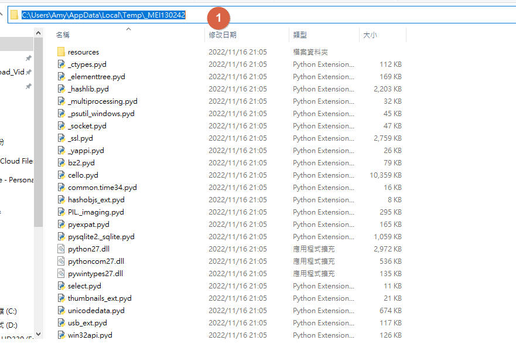
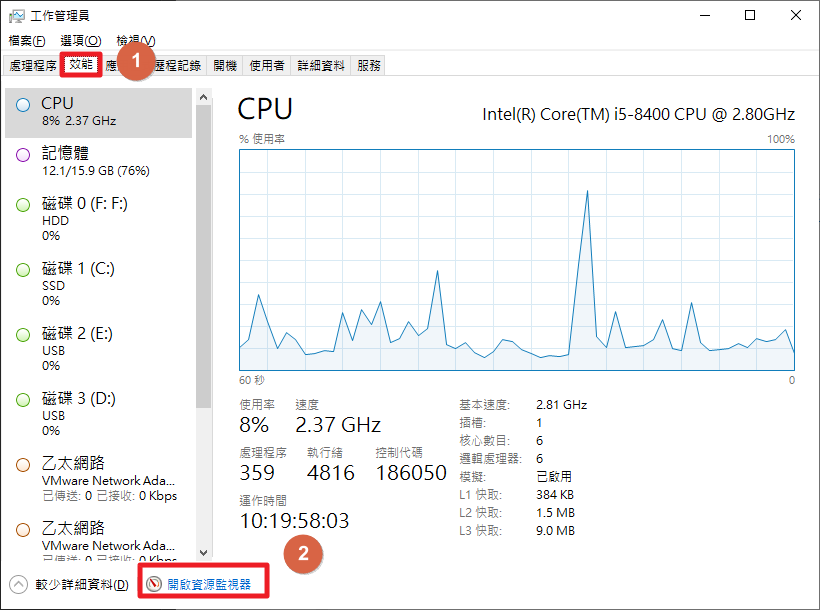
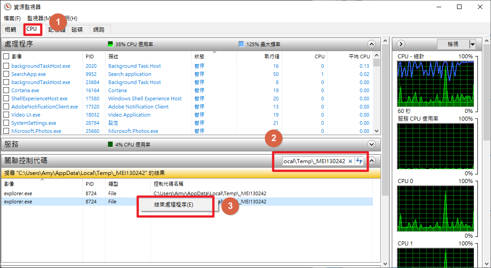

# 主要是針對檔案刪除時碰到正在執行中而無法刪除的檔案進行處理

+ ## 刪除被鎖住的檔案
  + ### Step1. 複製資料夾位置
    
  + ### Step2. 打開工作管理員->效能->資源監視器
        
  + ### Step3. 選擇CPU->控制代碼貼上資料夾位置->將搜尋出來的結果右鍵結束即可
    
    **注意: explorer.exe是開始的那個bar，關閉的話，bar是會隱藏的，需用工作管理員重啟**