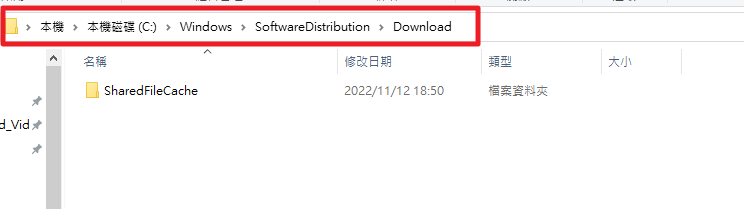
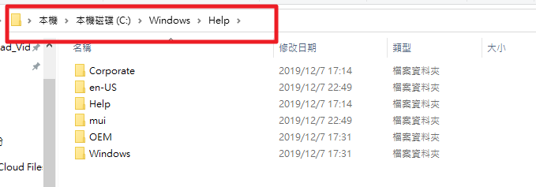
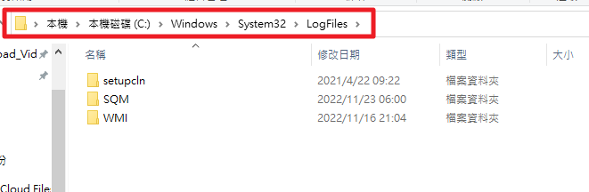
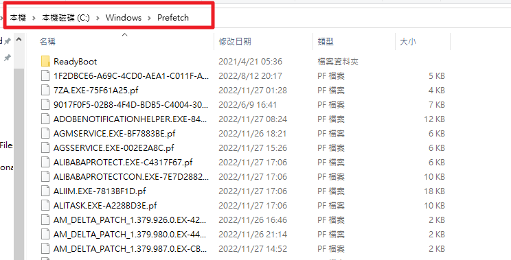
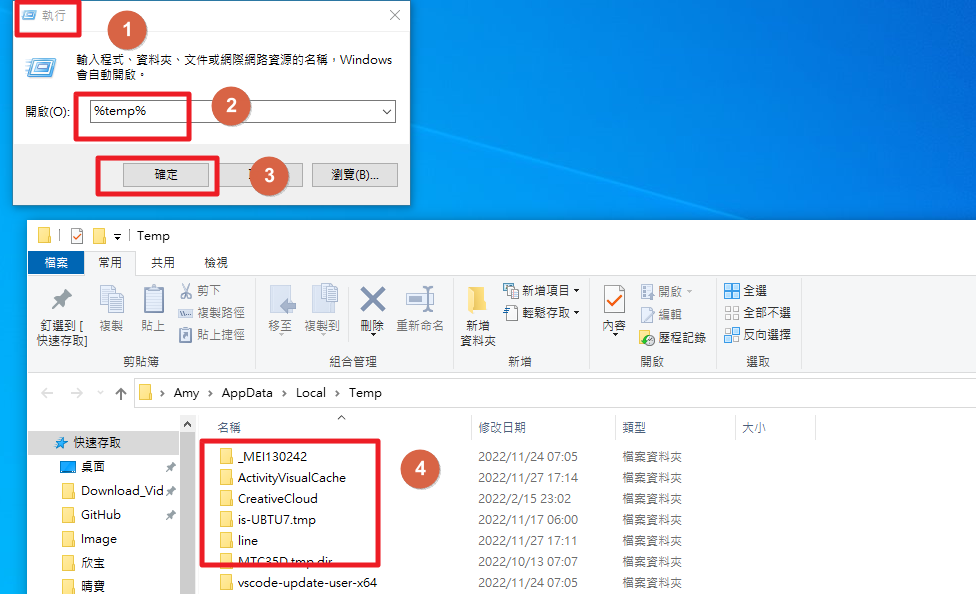

# 刪除檔案
---

+ ## 刪除被鎖住的檔案
  + ### Step1. 複製資料夾位置
    
  + ### Step2. 打開工作管理員->效能->資源監視器
        
  + ### Step3. 選擇CPU->控制代碼貼上資料夾位置->將搜尋出來的結果右鍵結束即可
    
    **注意: explorer.exe是開始的那個bar，關閉的話，bar是會隱藏的，需用工作管理員重啟**

+ ## 可以放心大膽刪的檔案
  + ### 1. Download
    **位於資料夾Windows/SoftwareDistribution/Download**
    **主要存放系統更新相關檔案**
    
  + ### 2. Help
    **位於資料夾Windows/Help**
    **系統的幫助文件**
    
  + ### 3. LogFiles
    **位於資料夾Windows/System32/LogFiles**
    **主要紀錄系統跟軟體的緩存日誌**
    
  + ### 4. Prefetch
    **位於資料夾Windows/Prefetch**
    **主要紀錄訪問過的文件的預讀資料**
    
  + ### 5. Temp
    **位於資料夾Windows/Temp**
    **主要存放暫存的文件**
    
  + ### 6. %Temp%
    **執行->%temp%，並刪除該資料夾內的檔案**
    **一樣是放暫存檔的**
    