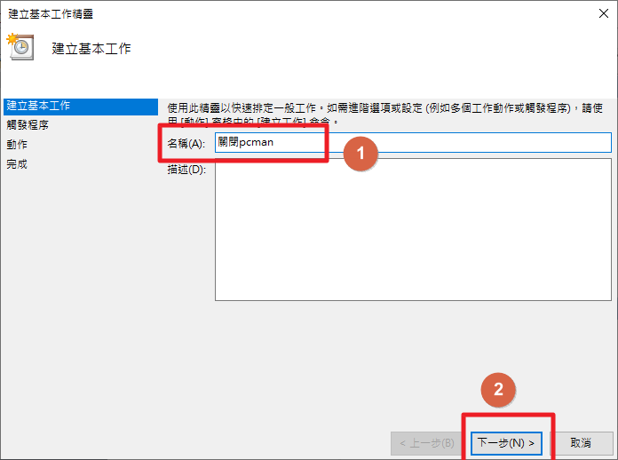
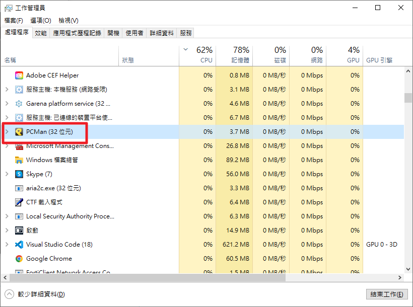
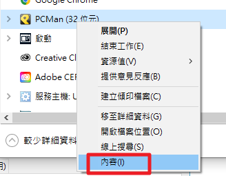

# 排程自動開關程式

+ ## 排程自動開啟程式
    + ### Step 1
    
    + ### Step 2
    
    + ### Step 3
    
    + ### Step 4
    
    + ### Step 5
    
    + ### Step 6
    
    + ### Step 7
    
    + ### Step 8
    
    **PS: 可以先用cmd來測試是否能正常開啟**
    
    + ### Step 9
    
    + ### Step 10
    
    **如果找不到，就按重新整理即可**

+ ## 排程自動關閉程式
    + ### Step 1
    
    + ### Step 2
    
    + ### Step 3
    
    + ### Step 4
    
    + ### Step 5
    
    + ### Step 6
    
    + ### Step 7
    
    + ### Step 8
    **先利用cmd來測試一下**
    
    **可利用工作管理員來尋找要關閉的程式名稱**
    
    **點擊滑鼠右鍵選擇內容**
    
    **直接把名稱複製起來，貼在cmd作測試**
    
    **cmd測試成功後，就把指令跟參數都複製貼上在格子內**
    
    **PS: taskkill是cmd的指令，可在cmd裡利用help來找到這個指令**
    **PS: taskkill的相關參數，也可在cmd裡利用taskkill /?來查看**
    
    **PS: 其中/F強制終止，/IM是指要終止的程序**
    ```
    /IM比較像是按X的感覺，拿pcman為例，你要是在連線中按X關閉會跳出確認的視窗
    而用/F /IM來關閉pcman就是強制關閉，並不會跳出確認視窗
    另外，有些軟體關閉它需要使用者權限，所以直接用/IM會發生無法關閉的現象，例如:Motrix
    ```
    
    + ### Step 9
    
    + ### Step 10
        