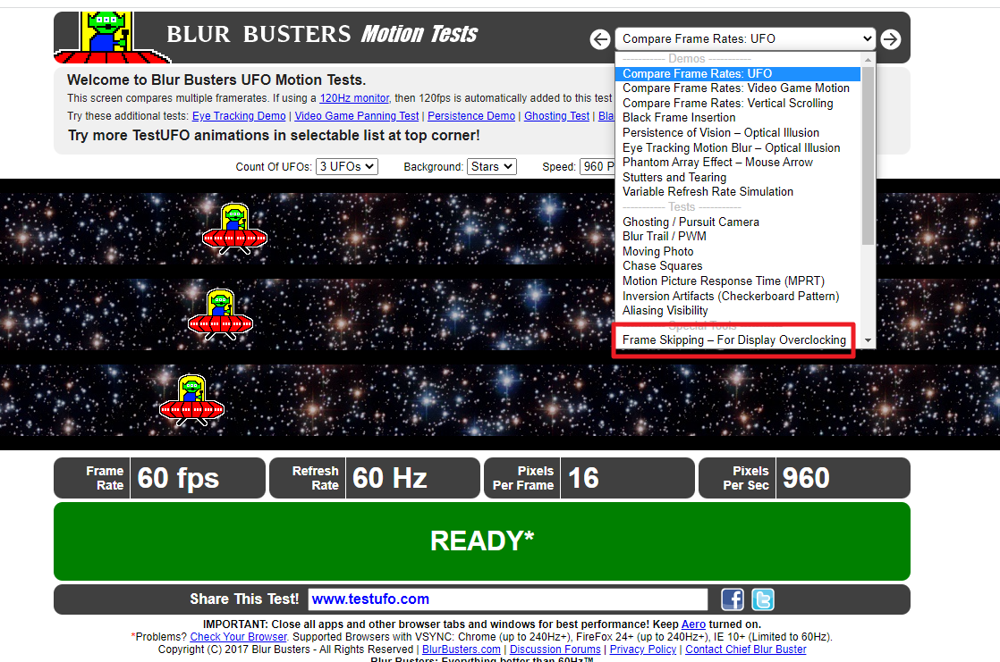
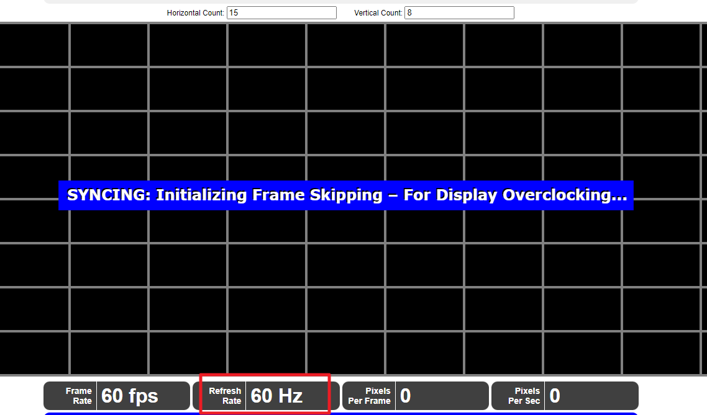
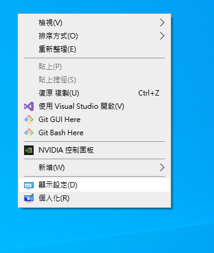
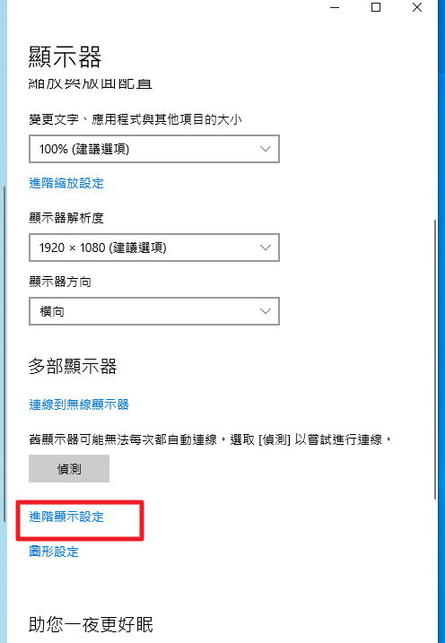
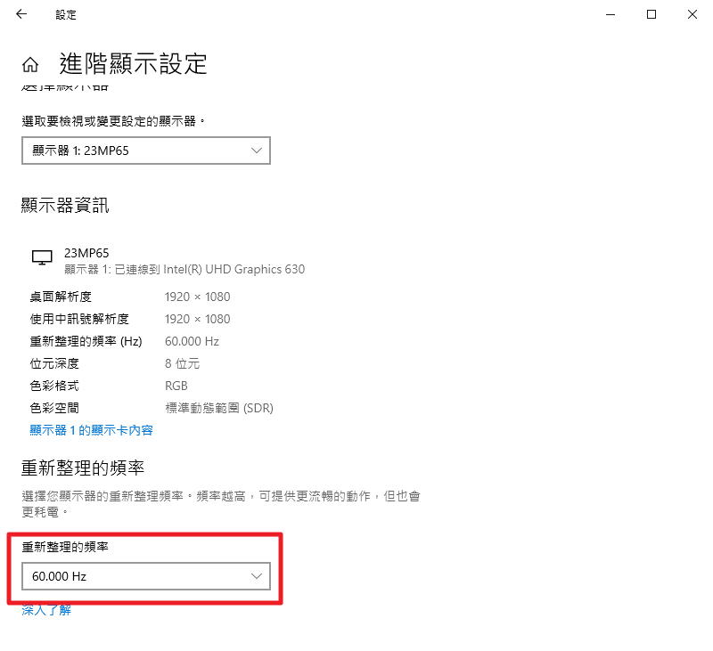

# 螢幕測試
---

+ ## 螢幕亮點測試
    [測試網站](https://www.ginifab.com.tw/tools/screen_test/)

+ ## 螢幕刷新率
    [測試網站](https://www.testufo.com/)
    ### Step1. 點入測試網站選擇紅框選項
    
    ### Step2. 紅框處即為真實刷新率
    
    ### Step3. 桌面右鍵選擇顯示設定
    
    ### Step4. 選擇進階顯示設定
    
    ### Step5. 紅框處可調整刷新率
    
